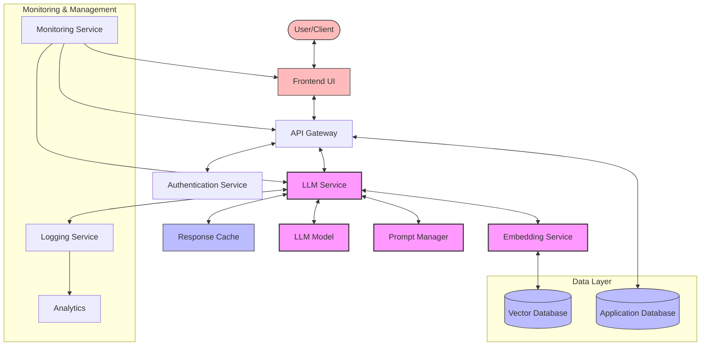

```mermaid
flowchart TD
    User([User/Client]) <--> FE[Frontend UI]
    FE <--> API[API Gateway]
    API <--> Auth[Authentication Service]
    API <--> LLM[LLM Service]
    LLM <--> Cache[Response Cache]
    LLM <--> Model[LLM Model]
    LLM <--> Embed[Embedding Service]
    Embed <--> VDB[(Vector Database)]
    LLM <--> PromptMgr[Prompt Manager]
    LLM <--> Log[Logging Service]
    Log --> Analytics[Analytics]

    subgraph "Data Layer"
        VDB
        DB[(Application Database)]
    end

    subgraph "Monitoring & Management"
        Log
        Analytics
        Monitor[Monitoring Service]
    end

    API <--> DB
    Monitor --> LLM
    Monitor --> API
    Monitor --> FE

    classDef core fill:#f9f,stroke:#333,stroke-width:2px
    classDef data fill:#bbf,stroke:#333,stroke-width:1px
    classDef user fill:#fbb,stroke:#333,stroke-width:1px

    class LLM,Model,Embed,PromptMgr core
    class VDB,DB,Cache data
    class User,FE user
```
